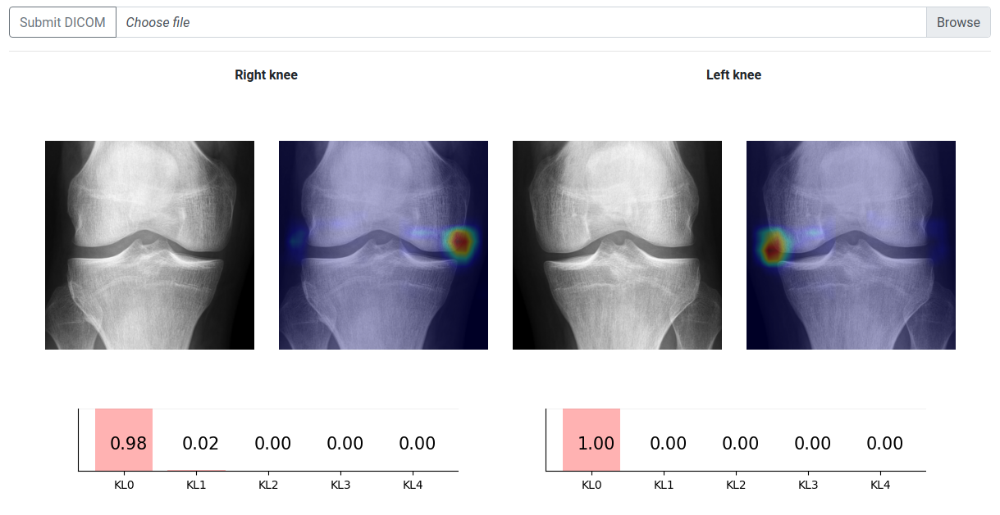
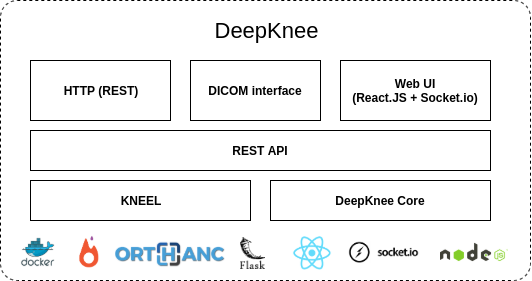

# About
The software in this branch implements an automatic pipeline for osteoarthritis severity assessment from plain radiographs.
It can be utilized via REST over HTTP or DICOM protocols. Furthermore, we have built a web UI that is easy to use.

The core Machine Learning pipeline is backed up by two papers:
1. Tiulpin, Aleksei, Iaroslav Melekhov, and Simo Saarakkala. 
"KNEEL: Knee Anatomical Landmark Localization Using Hourglass Networks." 
Proceedings of the IEEE International Conference on Computer Vision Workshops. 2019.
2. Tiulpin, Aleksei, et al. 
"Automatic knee osteoarthritis diagnosis from plain radiographs: A deep learning-based approach." 
Scientific reports 8.1 (2018): 1727.

# Authors
The whole package was built by Aleksei Tiulpin (@lext). Egor Panfilov (@soupault)
has built most of DeepKnee v1: https://github.com/MIPT-Oulu/DeepKnee-web (RIP). 
The current version of DeepKnee uses only the UI from the previous version.

# Disclaimer
This software is not a medical device and intended for the use in research settings only.

### Running the software
This code requires the fresh-most docker and docker compose installed.  
You can follow [INSTALLATION.md](INSTALLATION.md) and this will allow to install the 
DeepKnee and the dependencies.   

**!!Be careful, this app carries all the dependencies and weighs around 20GB in total!!**

Execute `sh deploy.sh cpu` to deploy the app on CPU. If you have installed `nvidia-docker`,
you can also deploy on GPU. The inference is 3 times faster on GPU. To deploy on GPU, run `sh deploy.sh gpu`. 
To test the software, just check in your browser `localhost:5003`. Here is an example of the result of processing
a single knee X-ray via UI:

<p align="center">
 
</p>

A YouTube Video describing the process of using the UI is shown here: https://youtu.be/4wcnmsxvim8.
The video has been recorded for DeepKnee v1, but nothing has really changed since then.

# Technical documentation
The software is currently composed of six separate loosely-coupled services. Specifically, those are:

1. `KNEEL` - Knee joint and landmark localization (https://arxiv.org/abs/1907.12237). REST microservice, port 5000.
2. `DeepKnee` - Automatic KL grading (this work, https://www.nature.com/articles/s41598-018-20132-7). REST microservice running on port 5001.
3. `Backend broker` - a NodeJS microservice implementing asynchronous communication between microservices and UI (socket.io). It runs on 5002 port.
4. `Orthanc PACS` - An embedded PACS that serves as a DICOM layer for clinical workflow integration
5. `Change polling` - A service that tracks what came to Orthanc and then forwards those data to DeepKnee as well as 
to PACS where user wants to store the results. By default, we use an embedded orthanc PACS as a remote PACS. However, this store is not
persistent and will be emptied upon restart. It is highly recommended to specify a persistent remote PACS
6. `UI` - User Interface implemented in ReactJS. This part runs on 5003, however the port can be changed in docker compose files.


The platform is designed so that it is possible to use `KNEEL` and `DeepKnee` separately. Both microservices expect
a `JSON` with `{dicom: <I64>}`, where `<I64>` is the dicom file encoded in `base64`. If you make a request to either of the services,
it needs to be done to `/kneel/predict/bilateral` or `/deepknee/predict/bilateral` for `KNEEL` and `DeepKnee`, respectively.

An example script that uses the platform can be found in the file `analyze_folder.py`.

Below you can see a schematic representation of the software architecture:

<p align="center">
 
</p>

## A few words about PACS integration
To deploy this software in your network with persistent PACS, you need to modify docker-compose file which is used
to run DeepKnee. Specifically, you need to change the entry point parameters of `dicom-router` service 
modifying `--remote_pacs_addr` and `--remote_pacs_port` parameters. The software creates an exact copy of the X-ray that 
came via DICOM, creates new Instance ID and then stores KL grades in `(00040, 0A160)` DICOM field. 
DeepKnee does not store neither heatmaps nor softmax outputs in DICOM. The AET for DeepKnee is `DEEPKNEE` :-).

## License
This code is freely available only for research purposes. Commercial use is not allowed by any means.
The provided software is not cleared for diagnostic purposes.

## How to cite
```
@article{tiulpin2018automatic,
  title={Automatic Knee Osteoarthritis Diagnosis from Plain Radiographs: A Deep Learning-Based Approach},
  author={Tiulpin, Aleksei and Thevenot, J{\'e}r{\^o}me and Rahtu, Esa and Lehenkari, Petri and Saarakkala, Simo},
  journal={Scientific reports},
  volume={8},
  number={1},
  pages={1727},
  year={2018},
  publisher={Nature Publishing Group}
}
```